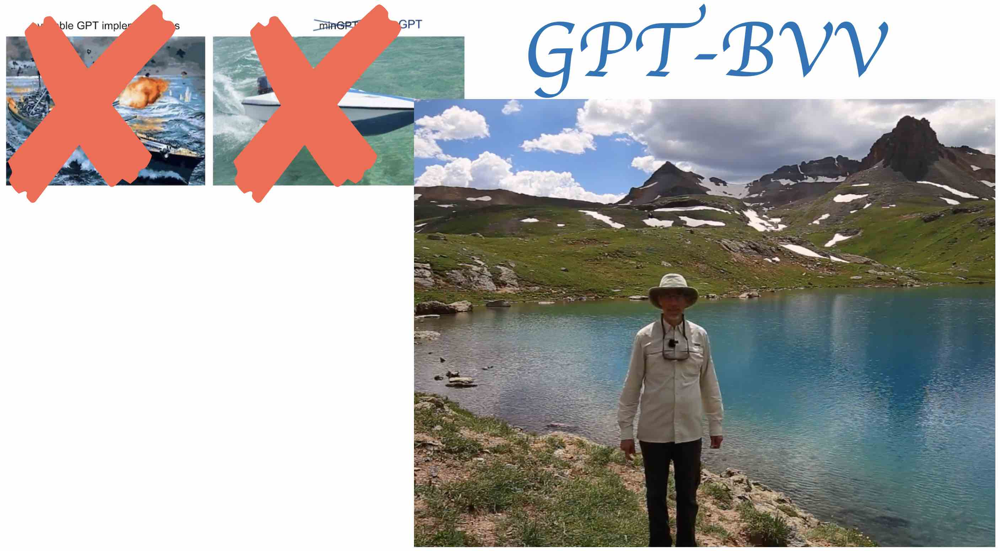

# nanoGPT, but for Barry Van Veen

The GPT-Barry-Van-Veen repository. It's a small GPT trained on a large number of poems on Prof. Barry Van Veen's life.

This is the active learning component of a special lecture `Unfolding the Magic of GPT: A Flipped Classroom Ode to Barry`, given at [BarryFest](https://optimization.discovery.wisc.edu/barryfest/) <3

It is a fork of [nanoGPT](https://github.com/karpathy/nanoGPT).
